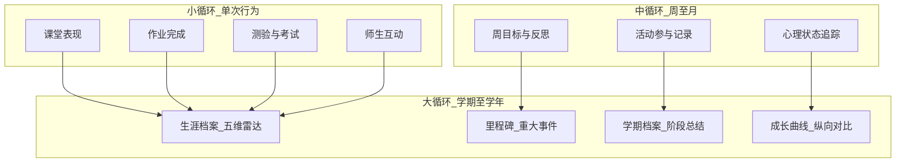

# 新府学「一生一案」学生生涯模式网站 — 建站指南

> **文档定位**：新府学私立学校学生生涯档案与成长追踪平台的**完整建站指南**。借鉴「商域 BizSim Edu」生涯模式的设计哲学——**双循环成长、里程碑叙事、五维雷达评估、赛季制节奏**——将其转译为面向真实学校场景的「一生一案」系统。
>
> **版本**：v1.0
> **最后更新**：2026-05-29

---

## 目录

1. [项目概述与愿景](#一项目概述与愿景)
2. [核心设计理念](#二核心设计理念)
3. [产品架构与三端设计](#三产品架构与三端设计)
4. [核心模块详解](#四核心模块详解)
5. [数据模型设计](#五数据模型设计)
6. [技术架构建议](#六技术架构建议)
7. [实施路线图](#七实施路线图)
8. [运营与维护](#八运营与维护)
9. [附录](#九附录)

---

## 一、项目概述与愿景

### 1.1 项目性质

　　**新府学「一生一案」** 是一个面向私立学校学生的**全周期成长档案与生涯发展平台**。它以学生为中心，记录其从入学到毕业的完整成长轨迹，整合学业成绩、心理测评、职业规划、性格分析、教师评语、活动参与、竞赛荣誉等多维数据，形成每位学生的**专属生涯档案**。

| 维度 | 说明 |
|------|------|
| **性质** | 学校内部教育信息化系统，服务教学管理与学生发展 |
| **愿景** | 让每个学生被"看见"——记录成长、认识自我、规划未来 |
| **使命** | 用数据照亮成长，用档案承载回忆，用测评引导方向 |
| **服务对象** | 学生（主体）、教师（记录者）、家长（观察者）、管理者（决策者） |

### 1.2 核心命题

　　传统学生档案是"成绩单 + 奖惩记录"的静态集合。「一生一案」将其进化为：

```
静态档案（成绩、评语）
    ↓
动态成长（五维雷达变化、里程碑时间线）
    ↓
自我认知（性格测评、职业倾向、心理状态）
    ↓
未来规划（目标设定、路径推荐、资源匹配）
```

　　**范式转换**：从"被评价的客体" → "主动经营自己成长的主体"。

### 1.3 与商域生涯模式的渊源

　　本平台借鉴商域「生涯模式」的以下设计哲学：

| 原概念 | 转译后 |
|--------|--------|
| **Career Hub（生涯中枢）** | **一生一案档案中心**——统一汇聚所有成长数据 |
| **双循环（小循环+大循环）** | **日常学习循环 + 学期/学年大循环** |
| **T0~T3 活动分级** | **学习/活动/比赛/重大赛事四级分类** |
| **赛季模式 vs 日常模式** | **学期模式 vs 假期/自主模式** |
| **五维雷达（商业素养）** | **五维雷达（学业/心理/职业/社交/特长）** |
| **XP 成长值** | **综合素养积分**——量化非学业成长 |
| **家园/家族建造** | **个人成长空间**——学生自主经营的虚拟领地 |
| **NPC 导师** | **心理导师/职业规划师/班主任** |
| **里程碑** | **在校重大事件**——升学、获奖、突破、转折 |
| **SettlementBundle 赛季结算** | **学期档案**——汇总一学期的全部成长 |

---

## 二、核心设计理念

### 2.1 双循环成长模型

　　理论来源：商域「双循环与多层级游戏设计理念」。转译后：



| 层级 | 名称 | 本平台载体 | 核心问题 |
|------|------|------------|----------|
| **小循环** | 单次行为 | 课堂表现、作业、测验、签到 | 我刚才的表现有反馈吗？ |
| **中循环** | 周/月循环 | 周反思、月度心理测评、活动参与 | 这个月我进步了吗？ |
| **大循环** | 学期/学年循环 | 五维雷达变化、里程碑、学期档案 | 我 overall 在成长吗？ |

### 2.2 「一生一案」档案哲学

　　每位学生拥有一份**持续生长**的电子档案：

- **入学时**：建立基础画像（性格测评、兴趣倾向、家庭背景）
- **在校期**：持续汇入成绩、评语、活动、比赛、心理测评
- **毕业时**：输出完整生涯档案（可导出 PDF，可分享升学使用）
- **离校后**：档案保留，作为校友身份可回顾

### 2.3 设计原则

| 原则 | 含义 | 产品体现 |
|------|------|----------|
| **以学生为中心** | 档案属于学生，不是学校的管理工具 | 学生可查看、可反思、可设定目标 |
| **全面性** | 不只成绩，关注全人发展 | 五维雷达覆盖学业、心理、职业、社交、特长 |
| **叙事性** | 成长需要故事 | 里程碑时间线、教师评语带情境、学期回顾 |
| **隐私性** | 敏感信息分级保护 | 心理测评细节仅学生+心理老师可见 |
| **渐进性** | 从简单记录到深度分析 | Phase A 记录 → Phase B 分析 → Phase C 规划 |
| **家校共育** | 家长是教育合伙人 | 家长端可见脱敏后的成长概览 |

---

## 三、产品架构与三端设计

### 3.1 总体架构

```
┌─────────────────────────────────────────────────────────────┐
│                     用户接触层                                │
│   ┌─────────────┐  ┌─────────────┐  ┌─────────────────────┐ │
│   │   学生端     │  │   教师端     │  │      管理端          │ │
│   │  (成长主角)  │  │  (记录者)    │  │   (决策者/管理员)     │ │
│   └─────────────┘  └─────────────┘  └─────────────────────┘ │
└─────────────────────────────────────────────────────────────┘
                              ↓
┌─────────────────────────────────────────────────────────────┐
│                     应用服务层                                │
│   档案中心 · 测评引擎 · 评语系统 · 里程碑 · 通知 · 报表         │
└─────────────────────────────────────────────────────────────┘
                              ↓
┌─────────────────────────────────────────────────────────────┐
│                      数据层                                   │
│   学生档案库 · 测评结果库 · 成绩库 · 活动库 · 用户权限库         │
└─────────────────────────────────────────────────────────────┘
```

### 3.2 学生端（Student Terminal）

　　学生端是学生的**个人成长空间**，核心功能是"看见自己"。

#### 主页布局

```
┌────────────────────────────────────────────┐
│  [头像] 姓名 · 年级 · 班级    [通知] [设置]   │
├────────────────────────────────────────────┤
│  📊 我的五维雷达                             │
│     学业 ──●──── 心理 ──●──── 职业           │
│     社交 ──●──── 特长 ──●────               │
├────────────────────────────────────────────┤
│  🎯 今日/本周目标          [编辑目标]         │
│     □ 完成数学作业                          │
│     □ 阅读30分钟                            │
│     □ 记录一件开心的事                       │
├────────────────────────────────────────────┤
│  📅 里程碑时间线（最近3件）                   │
│     ● 月考年级前50名（2周前）               │
│     ● 参加模拟联合国（1月前）               │
│     ● 心理测评完成（2月前）                 │
├────────────────────────────────────────────┤
│  📈 最新教师评语                            │
│     "你在这次小组展示中展现了出色的领导力..." │
├────────────────────────────────────────────┤
│  [我的档案] [心理测评] [职业规划] [活动记录]   │
└────────────────────────────────────────────┘
```

#### 功能模块

| 模块 | 功能 | 说明 |
|------|------|------|
| **我的档案** | 查看完整生涯档案 | 成绩、评语、活动、比赛、里程碑的时间线展示 |
| **五维雷达** | 五维能力可视化 | 学业/心理/职业/社交/特长，可查看历史变化 |
| **里程碑** | 记录重大事件 | 学生可自主添加（需审核），系统自动记录（获奖、升学等） |
| **心理测评** | 心理量表测试 | 焦虑、抑郁、学习动力、人际关系等量表；结果仅学生+心理老师可见 |
| **职业规划** | 职业兴趣与倾向 |霍兰德职业兴趣、MBTI性格、学科倾向测试 |
| **性格分析** | 个人特质画像 | 综合各测评结果，生成性格特点报告 |
| **教师评语** | 查看教师评语 | 按学科/时间查看，可收藏重要评语 |
| **活动记录** | 参与的校内外活动 | 社团、义工、研学、比赛等 |
| **成绩查询** | 各科成绩与趋势 | 支持成绩趋势图、班级/年级排名（可选） |
| **学期档案** | 学期总结报告 | 每学期末生成的综合报告 |
| **我的空间** | 个人成长空间 | 类似"家园"——学生可自定义、解锁装饰、展示成就 |

#### 隐私控制

| 信息类型 | 可见范围 |
|----------|----------|
| 成绩 | 学生 + 教师 + 家长 |
| 教师评语 | 学生 + 对应教师 + 班主任 + 家长 |
| 心理测评详情 | 学生 + 心理老师 |
| 心理测评概览 | 学生 + 家长（脱敏） |
| 职业规划 | 学生 + 职业规划老师 |
| 活动记录 | 学生 + 教师 + 家长 |
| 里程碑 | 学生 + 教师 + 家长 |

### 3.3 教师端（Teacher Terminal）

　　教师端是教师的**学生观察与记录工作台**，核心功能是"看见学生"。

#### 主页布局

```
┌────────────────────────────────────────────┐
│  [头像] 张老师 · 高二年级    [通知] [设置]    │
├────────────────────────────────────────────┤
│  📋 我的班级                                 │
│     高二(1)班 [45人]   高二(2)班 [43人]     │
├────────────────────────────────────────────┤
│  ⚠️ 需要关注的学生（基于心理测评预警）        │
│     李同学 · 焦虑量表偏高 · 建议关注          │
│     王同学 · 连续两周未记录心情 · 建议沟通     │
├────────────────────────────────────────────┤
│  📝 待写评语（本周）                         │
│     高二(1)班：12/45 已完成                 │
│     高二(2)班：8/43 已完成                  │
├────────────────────────────────────────────┤
│  📊 班级五维雷达概览                         │
│     [班级平均雷达图]                         │
├────────────────────────────────────────────┤
│  [学生列表] [写评语] [心理预警] [活动管理]     │
└────────────────────────────────────────────┘
```

#### 功能模块

| 模块 | 功能 | 说明 |
|------|------|------|
| **我的学生** | 班级学生列表 | 查看所教班级/指导学生的概览卡片 |
| **学生详情** | 单个学生档案 | 查看该学生的完整档案（受隐私权限控制） |
| **写评语** | 撰写学生评语 | 按学生撰写阶段性评语，支持模板与快捷输入 |
| **评语管理** | 查看/编辑历史评语 | 管理自己撰写的所有评语 |
| **心理预警** | 关注学生心理状态 | 查看心理测评预警列表，标记关注状态 |
| **活动管理** | 记录学生参与活动 | 为学生活动打标签、写评价 |
| **班级画像** | 班级整体分析 | 班级五维雷达、成绩分布、活动参与度 |
| **家长沟通** | 生成家长报告 | 一键生成学生阶段性报告，供家长会见使用 |

#### 教师权限边界

| 教师类型 | 可查看 | 可操作 |
|----------|--------|--------|
| **班主任** | 全班学生完整档案 | 写评语、记录活动、查看心理预警概览 |
| **学科教师** | 所教班级学生的成绩+自己的评语+活动记录 | 写学科评语 |
| **心理老师** | 全校学生心理测评详情 | 发布/管理测评、查看预警、干预记录 |
| **职业规划老师** | 全校学生职业规划数据 | 发布/管理测评、职业咨询记录 |

### 3.4 管理端（Admin Terminal）

　　管理端是学校管理者的**数据驾驶舱与系统配置中心**。

#### 功能模块

| 模块 | 功能 | 说明 |
|------|------|------|
| **学生管理** | 学生信息 CRUD | 入学/转学/毕业处理、班级调整 |
| **教师管理** | 教师信息 CRUD | 任教关系、权限分配 |
| **班级管理** | 班级结构管理 | 年级-班级-学生层级 |
| **测评管理** | 心理/职业测评配置 | 发布测评、设置周期、管理量表 |
| **评语模板** | 评语模板库 | 维护评语快捷模板、评价维度 |
| **活动库** | 校内外活动管理 | 活动定义、分类、学分规则 |
| **数据报表** | 全校/年级/班级统计 | 五维分布、成绩趋势、活动参与率 |
| **里程碑配置** | 系统里程碑规则 | 自动触发条件（如"首次年级前十"） |
| **系统配置** | 平台参数设置 | 学期时间、积分规则、隐私策略 |
| **内容审核** | 学生生成内容审核 | 学生自添加里程碑的审核 |

---

## 四、核心模块详解

### 4.1 一生一案档案中心（Career Hub）

　　档案中心是平台的**数据中枢**，汇聚所有与学生成长相关的数据。

#### 档案时间线

```
入学 (2024-09)
  │
  ├─ 基础画像：性格测评、兴趣倾向、家庭背景
  │
  ├─ 高一上学期 (2024-09 ~ 2025-01)
  │   ├─ 月考成绩 × 3
  │   ├─ 教师评语 × 8（学科+班主任）
  │   ├─ 期中/期末考试
  │   ├─ 心理测评 × 1
  │   ├─ 参与活动：军训、社团招新、运动会
  │   ├─ 里程碑："第一次月考班级前10"
  │   └─ 学期档案（自动生成）
  │
  ├─ 高一下学期 (2025-02 ~ 2025-07)
  │   ├─ ...（同上结构）
  │   ├─ 里程碑："获得英语演讲比赛一等奖"
  │   └─ 学期档案
  │
  ├─ 高二...
  │
  └─ 毕业 (2027-06)
      └─ 完整生涯档案（可导出）
```

#### 档案组成部分

| 部分 | 内容 | 来源 |
|------|------|------|
| **基础信息** | 姓名、性别、入学时间、班级 | 管理系统录入 |
| **学业记录** | 各科成绩、排名趋势、学分 | 成绩系统对接/手动录入 |
| **教师评语** | 阶段性评语、即时反馈 | 教师端撰写 |
| **心理档案** | 测评结果、心理状态变化 | 心理测评模块 |
| **职业规划** | 职业兴趣、性格特点、目标学校 | 职业规划模块 |
| **活动记录** | 社团、义工、研学、比赛 | 教师记录+学生申报 |
| **里程碑** | 重大事件、突破时刻 | 自动触发+学生申报+教师标记 |
| **荣誉记录** | 获奖、表彰、证书 | 活动/比赛模块关联 |
| **成长曲线** | 五维雷达历史变化 | 系统计算 |
| **学期档案** | 阶段性综合报告 | 自动生成 |

### 4.2 五维雷达评估体系

　　借鉴商域「五维雷达」设计，转译为学校教育场景：

```
            学业能力
           /    |    \
          /     |     \
    特长发展 ───┼─── 心理健康
          \     |     /
           \    |    /
            社交协作
```

| 维度 | 评估指标 | 数据来源 |
|------|----------|----------|
| **学业能力** | 成绩稳定性、学科均衡度、学习投入 | 成绩系统 + 教师评价 |
| **心理健康** | 情绪稳定性、压力应对、自我认知 | 心理测评 + 心情记录 |
| **职业规划** | 目标清晰度、职业兴趣匹配、行动力 | 职业规划测评 + 目标设定 |
| **社交协作** | 团队合作、沟通能力、人际关系 | 教师评语 + 活动表现 |
| **特长发展** | 兴趣深度、技能水平、成果产出 | 活动记录 + 比赛成绩 |

#### 雷达图展示

- 学生端：个人雷达图 + 班级平均线对比
- 教师端：班级雷达图 + 学生个体对比
- 时间维度：可选不同学期对比，查看成长变化

### 4.3 里程碑系统

　　里程碑是学生在学校的**重大事件与关键时刻**，构成生涯叙事的骨架。

#### 里程碑类型

| 类型 | 说明 | 触发方式 |
|------|------|----------|
| **学业里程碑** | 首次年级前十、某科突破、升学晋级 | 系统自动（成绩达标） |
| **活动里程碑** | 首次参加某类活动、担任社团干部 | 教师标记 / 学生申报 |
| **比赛里程碑** | 获得奖项、代表学校参赛 | 活动模块关联 |
| **心理里程碑** | 克服某个困难、心理状态显著改善 | 心理老师标记 |
| **个人里程碑** | 学生自认为重要的事件 | 学生申报 + 班主任审核 |
| **成长里程碑** | 五维某项突破阈值 | 系统自动 |

#### 里程碑卡片

```
┌────────────────────────────────────┐
│  🏆 里程碑 · 2025-03-15            │
│                                    │
│  "首次月考进入年级前十"            │
│                                    │
│  类型：学业                        │
│  触发：系统自动                    │
│  描述：本次月考总分位列年级第8名， │
│       相比入学排名进步了42名。     │
│                                    │
│  [关联成绩] [关联评语] [分享]      │
└────────────────────────────────────┘
```

### 4.4 教师评语系统

　　评语是连接教师观察与学生自我认知的**关键纽带**。

#### 评语类型

| 类型 | 频率 | 撰写人 | 内容侧重 |
|------|------|--------|----------|
| **学科评语** | 每月/每单元 | 学科教师 | 学科表现、学习态度、改进建议 |
| **班主任评语** | 每学期 | 班主任 | 综合表现、性格特点、成长建议 |
| **即时反馈** | 随时 | 任何教师 | 某次活动/课堂的即时观察 |
| **阶段性评语** | 期中/期末 | 班主任 | 阶段总结、下学期期望 |

#### 评语撰写辅助

- **模板库**：按场景提供评语模板，教师可快速选择与修改
- **维度引导**：引导教师从"学业/态度/协作/创新/责任"五个维度评价
- **历史参考**：撰写时自动展示该学生历史评语，避免重复
- **快捷标签**：常用描述标签一键插入（如"积极主动"、"需加强时间管理"）

#### 评语展示（学生端）

```
┌────────────────────────────────────────────┐
│  评语 · 2025年春季学期 · 班主任             │
├────────────────────────────────────────────┤
│                                            │
│  "小明这学期在班级活动中表现出了很强的组织  │
│   能力，特别是在科技节的项目展示中，他主动   │
│   承担了组长的责任，带领小组获得了二等奖。   │
│                                            │
│   学业方面，数学和物理保持了稳定的高水平，   │
│   但英语阅读理解需要加强练习。建议下学期多   │
│   参加英语角活动，提升语言应用能力。"        │
│                                            │
│  —— 王老师 · 2025-07-05                    │
│                                            │
│  [❤️ 收藏] [📌 加入里程碑] [💬 写感谢]      │
└────────────────────────────────────────────┘
```

### 4.5 心理测评模块

　　心理测评帮助学生和学校**及时发现问题、科学引导**。

#### 测评量表库

| 量表 | 用途 | 频率 |
|------|------|------|
| **中学生心理健康量表(MSSMHS)** | 整体心理健康筛查 | 每学期1次 |
| **焦虑自评量表(SAS)** | 焦虑程度评估 | 按需/月度 |
| **抑郁自评量表(SDS)** | 抑郁倾向筛查 | 按需/月度 |
| **学习动机量表** | 学习动力评估 | 每学期1次 |
| **人际关系综合诊断量表** | 人际状况评估 | 每学期1次 |
| **压力应对方式问卷** | 应对策略分析 | 每学期1次 |

#### 心情日记（学生自记录）

- 学生可每日记录心情（1-5星 + 简短文字）
- 系统生成心情趋势图
- 连续异常提醒教师关注

#### 预警机制

```
测评完成 → 自动评分 → 阈值判断
                      │
          ┌──────────┼──────────┐
         正常        关注        预警
          │          │          │
        归档      标记关注    通知心理老师
                   教师可见    通知班主任
                              建议干预
```

### 4.6 职业规划模块

　　帮助学生**认识自我、探索方向、设定目标**。

#### 测评工具

| 工具 | 内容 | 输出 |
|------|------|------|
| **霍兰德职业兴趣测试** | RIASEC六型兴趣 | 职业兴趣代码 + 推荐方向 |
| **MBTI性格测试** | 16型人格 | 性格特点 + 适合领域 |
| **学科倾向测评** | 文理倾向、学科偏好 | 学科优势分析 |
| **目标设定工具** | 短期/中期/长期目标 | 目标时间线 + 行动建议 |

#### 职业探索

- **职业百科**：常见职业介绍（工作内容、所需能力、发展路径）
- **校友故事**：本校毕业生分享（脱敏后）
- **目标学校库**：国内外大学/专业信息

### 4.7 个人成长空间

　　借鉴商域「家园/家族建造」概念，转译为学生的**个人成长空间**。

#### 空间概念

- 每个学生有一个可自定义的虚拟空间
- 通过完成活动、达成目标、获得成就来**解锁装饰与功能**
- 空间展示学生的成就、里程碑、收藏内容

#### 解锁体系

| 解锁项 | 条件 | 效果 |
|--------|------|------|
| **基础空间** | 入学即得 | 默认主题、基础功能 |
| **成长书架** | 完成3次心理测评 | 展示测评历史 |
| **荣誉墙** | 获得首个奖项 | 展示获奖记录 |
| **目标树** | 设定首个目标 | 可视化目标进度 |
| **时间花园** | 记录心情30天 | 心情趋势可视化 |
| **职业罗盘** | 完成职业规划测评 | 展示职业兴趣图谱 |

### 4.8 学期模式与学期档案

#### 学期生命周期

| 阶段 | 时间 | 系统行为 |
|------|------|----------|
| **开学** | 学期初 | 初始化学期档案框架、推送学期目标设定 |
| **期中** | 学期中 | 生成期中回顾（前半学期数据汇总） |
| **期末** | 学期末 | 汇总全学期数据、生成学期档案 |
| **假期** | 寒暑假 | 自主模式——学生可自由使用测评、设定目标 |

#### 学期档案内容

```
┌────────────────────────────────────────────┐
│     新府学 · 2024-2025学年第一学期档案       │
│              学生：张明 · 高一(1)班           │
├────────────────────────────────────────────┤
│                                            │
│  一、学业概况                                │
│     总分排名：班级 5/45 · 年级 23/200        │
│     各科成绩趋势：[折线图]                   │
│     最强学科：数学 · 需加强：英语             │
│                                            │
│  二、五维雷达变化                            │
│     [本学期 vs 上学期雷达对比图]             │
│     最大进步：社交协作 (+15%)               │
│                                            │
│  三、里程碑（本学期）                        │
│     🏆 军训优秀学员                         │
│     🏆 首次月考班级前10                      │
│     🏆 加入机器人社团                        │
│                                            │
│  四、活动参与                                │
│     校内：运动会(跳高第3) · 科技节 · 英语角×6 │
│     校外：模拟联合国会议                     │
│                                            │
│  五、教师评语精选                            │
│     [班主任评语摘要]                        │
│     [数学教师评语摘要]                      │
│                                            │
│  六、心理状态                                │
│     整体评价：良好                          │
│     心情记录：平均4.2/5.0                   │
│                                            │
│  七、下学期目标建议                          │
│     基于本学期数据自动生成                   │
│                                            │
└────────────────────────────────────────────┘
```

---

## 五、数据模型设计

### 5.1 核心实体关系

```
┌─────────────┐     ┌─────────────┐     ┌─────────────┐
│   School    │────<│    Grade    │────<│    Class    │
│   (学校)     │     │   (年级)     │     │   (班级)     │
└─────────────┘     └─────────────┘     └──────┬──────┘
                                               │
┌─────────────┐     ┌─────────────┐            │
│   Teacher   │◄───>│ TeacherClass │────────────┘
│   (教师)     │     │  (任教关系)   │
└──────┬──────┘     └─────────────┘
       │
       │            ┌─────────────┐
       └───────────>│   Comment   │
                    │   (评语)     │
┌─────────────┐     └──────▲──────┘
│   Student   │────────────┘
│   (学生)     │◄─────────────────────────────┐
└──────┬──────┘                                │
       │                                       │
       │    ┌─────────────┐     ┌─────────────┐│
       ├───>│  Assessment │     │  Milestone  ││
       │    │  (测评结果)  │     │  (里程碑)    ││
       │    └─────────────┘     └─────────────┘│
       │                                       │
       │    ┌─────────────┐     ┌─────────────┐│
       ├───>│   Activity  │     │   Score     ││
       │    │  (活动记录)  │     │  (成绩)      ││
       │    └─────────────┘     └─────────────┘│
       │                                       │
       │    ┌─────────────┐     ┌─────────────┐│
       └───>│  CareerProfile│◄───│  SemesterReport│
            │  (生涯档案)   │     │  (学期档案)   │
            └─────────────┘     └─────────────┘
```

### 5.2 核心表结构（参考）

#### 学生表 (students)

| 字段 | 类型 | 说明 |
|------|------|------|
| id | PK | 主键 |
| user_id | FK | 关联用户表 |
| student_no | string | 学号 |
| name | string | 姓名 |
| gender | enum | 性别 |
| class_id | FK | 班级 |
| enrollment_date | date | 入学日期 |
| graduation_date | date | 毕业日期（nullable） |
| status | enum | 在读/休学/毕业/转学 |
| created_at | timestamp | 创建时间 |

#### 教师表 (teachers)

| 字段 | 类型 | 说明 |
|------|------|------|
| id | PK | 主键 |
| user_id | FK | 关联用户表 |
| name | string | 姓名 |
| title | string | 职称 |
| subjects | json | 任教科目 |
| role | enum | 班主任/学科教师/心理老师/职业规划老师/管理员 |
| created_at | timestamp | 创建时间 |

#### 评语表 (comments)

| 字段 | 类型 | 说明 |
|------|------|------|
| id | PK | 主键 |
| student_id | FK | 学生 |
| teacher_id | FK | 教师 |
| type | enum | 学科评语/班主任评语/即时反馈/阶段性评语 |
| content | text | 评语内容 |
| dimensions | json | 评价维度评分 {学业,态度,协作,创新,责任} |
| semester | string | 学期标识（如"2024-2025-1"） |
| is_pinned | boolean | 是否被学生置顶 |
| created_at | timestamp | 创建时间 |

#### 测评结果表 (assessments)

| 字段 | 类型 | 说明 |
|------|------|------|
| id | PK | 主键 |
| student_id | FK | 学生 |
| type | enum | 心理测评/职业测评/性格测评 |
| scale_name | string | 量表名称 |
| scale_code | string | 量表代码 |
| result_json | json | 测评结果（结构化存储） |
| score | decimal | 总分（如有） |
| risk_level | enum | 正常/关注/预警（心理测评用） |
| visible_to_student | boolean | 学生是否可见详情 |
| visible_to_parent | boolean | 家长是否可见概览 |
| created_at | timestamp | 创建时间 |

#### 里程碑表 (milestones)

| 字段 | 类型 | 说明 |
|------|------|------|
| id | PK | 主键 |
| student_id | FK | 学生 |
| type | enum | 学业/活动/比赛/心理/个人/成长 |
| title | string | 标题 |
| description | text | 描述 |
| source | enum | 系统自动/教师标记/学生申报 |
| status | enum | 待审核/已通过/已拒绝（学生申报用） |
| occurred_at | date | 发生日期 |
| related_data | json | 关联数据（如成绩ID、活动ID） |
| created_at | timestamp | 创建时间 |

#### 生涯档案表 (career_profiles)

| 字段 | 类型 | 说明 |
|------|------|------|
| id | PK | 主键 |
| student_id | FK | 学生（唯一） |
| five_dimensions | json | 五维评分 {学业,心理,职业,社交,特长} |
| dimension_history | json | 五维历史变化数组 |
| total_score | int | 综合素养积分 |
| level | int | 成长等级（可选游戏化） |
| unlocked_items | json | 成长空间已解锁项 |
| goals | json | 当前目标列表 |
| created_at | timestamp | 创建时间 |
| updated_at | timestamp | 更新时间 |

#### 成绩表 (scores)

| 字段 | 类型 | 说明 |
|------|------|------|
| id | PK | 主键 |
| student_id | FK | 学生 |
| subject | string | 科目 |
| exam_type | enum | 月考/期中/期末/平时测验 |
| score | decimal | 分数 |
| total | decimal | 满分 |
| class_rank | int | 班级排名 |
| grade_rank | int | 年级排名 |
| semester | string | 学期标识 |
| exam_date | date | 考试日期 |

#### 活动记录表 (activities)

| 字段 | 类型 | 说明 |
|------|------|------|
| id | PK | 主键 |
| student_id | FK | 学生 |
| name | string | 活动名称 |
| category | enum | 社团/义工/研学/比赛/文体/其他 |
| type | enum | 校内/校外 |
| role | string | 参与者/组织者/获奖者 |
| result | string | 成果/奖项（如有） |
| start_date | date | 开始日期 |
| end_date | date | 结束日期 |
| teacher_evaluation | text | 教师评价 |
| proof_files | json | 证明材料（照片/证书） |
| status | enum | 待审核/已通过 |

#### 学期档案表 (semester_reports)

| 字段 | 类型 | 说明 |
|------|------|------|
| id | PK | 主键 |
| student_id | FK | 学生 |
| semester | string | 学期标识 |
| report_json | json | 完整报告数据（结构化） |
| pdf_url | string | PDF导出地址 |
| is_published | boolean | 是否已发布（学生/家长可见） |
| created_at | timestamp | 创建时间 |

### 5.3 综合素养积分规则

　　借鉴商域「XP 成长值」概念，设计综合素养积分体系：

| 行为 | 积分 | 说明 |
|------|------|------|
| 完成心理测评 | +20 | 每学期首次 |
| 记录心情连续7天 | +10 | 鼓励日常记录 |
| 完成职业规划测评 | +20 | 每学期首次 |
| 设定并达成目标 | +15 | 每个目标 |
| 参与活动 | +10~50 | 依活动级别 |
| 获得比赛奖项 | +30~100 | 依奖项级别 |
| 被教师评优 | +10 | 每条优秀评语 |
| 学期档案完成 | +50 | 每学期 |
| 里程碑达成 | +20~50 | 依里程碑级别 |
| 个人空间解锁项 | +5~20 | 每个解锁 |

---

## 六、技术架构建议

### 6.1 技术栈选型

| 层级 | 推荐技术 | 备选方案 |
|------|----------|----------|
| **前端框架** | React 18 + TypeScript | Vue 3 + TypeScript |
| **UI组件库** | Ant Design | Element Plus |
| **状态管理** | Zustand | Redux Toolkit |
| **后端框架** | Node.js + NestJS | Python + FastAPI |
| **数据库** | PostgreSQL | MySQL 8 |
| **缓存** | Redis | — |
| **文件存储** | 阿里云OSS / 腾讯云COS | MinIO |
| **部署** | Docker + Docker Compose | Kubernetes（后期） |
| **CI/CD** | GitHub Actions | GitLab CI |

### 6.2 系统架构

```
┌─────────────────────────────────────────────────────────────┐
│                        Nginx (反向代理)                       │
└─────────────────────────────────────────────────────────────┘
                              │
        ┌─────────────────────┼─────────────────────┐
        ▼                     ▼                     ▼
┌───────────────┐    ┌───────────────┐    ┌───────────────┐
│   学生端前端    │    │   教师端前端    │    │   管理端前端   │
│  (React SPA)  │    │  (React SPA)  │    │  (React SPA)  │
└───────┬───────┘    └───────┬───────┘    └───────┬───────┘
        │                    │                    │
        └────────────────────┼────────────────────┘
                             ▼
              ┌──────────────────────────┐
              │     NestJS API 服务       │
              │  ┌────────────────────┐  │
              │  │  认证模块 (JWT)     │  │
              │  │  档案中心模块       │  │
              │  │  评语模块           │  │
              │  │  测评模块           │  │
              │  │  里程碑模块         │  │
              │  │  成绩模块           │  │
              │  │  活动模块           │  │
              │  │  学期档案模块       │  │
              │  │  通知模块           │  │
              │  └────────────────────┘  │
              └────────────┬─────────────┘
                           │
        ┌──────────────────┼──────────────────┐
        ▼                  ▼                  ▼
┌───────────────┐  ┌───────────────┐  ┌───────────────┐
│  PostgreSQL   │  │    Redis      │  │   对象存储     │
│  (主数据库)    │  │  (缓存/会话)   │  │  (文件/图片)   │
└───────────────┘  └───────────────┘  └───────────────┘
```

### 6.3 项目目录结构

```
xinfuxue-career/
├── apps/
│   ├── web-student/          # 学生端前端
│   ├── web-teacher/          # 教师端前端
│   ├── web-admin/            # 管理端前端
│   └── api/                  # 后端 API
│       ├── src/
│       │   ├── modules/
│       │   │   ├── auth/           # 认证
│       │   │   ├── students/       # 学生管理
│       │   │   ├── teachers/       # 教师管理
│       │   │   ├── classes/        # 班级管理
│       │   │   ├── comments/       # 评语系统
│       │   │   ├── assessments/    # 测评系统
│       │   │   ├── milestones/     # 里程碑
│       │   │   ├── scores/         # 成绩
│       │   │   ├── activities/     # 活动
│       │   │   ├── career-profiles/# 生涯档案
│       │   │   ├── semester-reports/ # 学期档案
│       │   │   ├── notifications/  # 通知
│       │   │   └── uploads/        # 文件上传
│       │   ├── database/
│       │   │   ├── entities/       # 实体定义
│       │   │   └── migrations/     # 迁移文件
│       │   ├── common/             # 公共工具
│       │   └── main.ts             # 入口
│       └── package.json
├── packages/
│   ├── shared-types/         # 共享类型定义
│   └── ui-components/        # 共享UI组件
├── docker/
│   ├── docker-compose.yml
│   └── Dockerfile
└── docs/                     # 项目文档
```

### 6.4 API 设计规范

```
/api/v1
├── /auth
│   ├── POST /login
│   ├── POST /logout
│   └── GET /me
├── /students
│   ├── GET /               # 列表（管理端）
│   ├── GET /:id            # 详情
│   ├── GET /:id/profile    # 生涯档案
│   ├── GET /:id/timeline   # 时间线
│   └── PUT /:id/goals      # 更新目标
├── /teachers
│   ├── GET /:id/students   # 我的学生
│   └── GET /:id/classes    # 我的班级
├── /comments
│   ├── POST /              # 写评语
│   ├── GET /               # 评语列表
│   └── PUT /:id            # 编辑评语
├── /assessments
│   ├── POST /              # 提交测评
│   ├── GET /               # 测评列表
│   └── GET /:id/result     # 测评结果
├── /milestones
│   ├── POST /              # 创建里程碑
│   ├── GET /               # 里程碑列表
│   └── PUT /:id/approve    # 审核里程碑
├── /scores
│   ├── POST /              # 录入成绩
│   ├── GET /               # 成绩列表
│   └── GET /:id/trend      # 成绩趋势
├── /activities
│   ├── POST /              # 记录活动
│   ├── GET /               # 活动列表
│   └── PUT /:id/approve    # 审核活动
├── /semester-reports
│   ├── POST /generate      # 生成学期档案
│   ├── GET /:id            # 查看学期档案
│   └── POST /:id/publish   # 发布学期档案
└── /admin
    ├── /students           # 学生管理
    ├── /teachers           # 教师管理
    ├── /classes            # 班级管理
    ├── /assessment-scales  # 测评量表管理
    └── /settings           # 系统设置
```

---

## 七、实施路线图

### 7.1 分期实施策略

　　采用渐进式交付，每阶段都有可验收的产出。

#### Phase 1：档案基础（MVP — 2~3个月）

**目标**：建立学生档案、教师可写评语、学生可查看——完成最小可用闭环。

| 工作项 | 验收标准 |
|--------|----------|
| 学生端登录 + 基础档案页 | 学生可登录，查看自己的基本信息和成绩 |
| 教师端登录 + 学生列表 | 教师可登录，查看自己的班级和学生列表 |
| 教师写评语 | 教师可为学生撰写并保存评语 |
| 学生查看评语 | 学生可在档案中查看教师评语 |
| 成绩录入与展示 | 管理员可导入成绩，学生可查看 |
| 基础权限系统 | 学生/教师/管理员三种角色 |

#### Phase 2：测评与里程碑（2个月）

**目标**：加入心理/职业测评、里程碑系统、五维雷达初版。

| 工作项 | 验收标准 |
|--------|----------|
| 心理测评模块 | 学生可完成心理量表，查看结果 |
| 职业规划测评 | 学生可完成霍兰德/MBTI测评 |
| 里程碑系统 | 学生可申报里程碑，教师可审核 |
| 五维雷达 | 根据已有数据生成雷达图 |
| 活动记录 | 教师可记录学生参与活动 |
| 心情日记 | 学生可每日记录心情 |

#### Phase 3：学期档案与成长空间（2个月）

**目标**：自动生成学期档案、个人成长空间、家长端。

| 工作项 | 验收标准 |
|--------|----------|
| 学期档案自动生成 | 学期末自动生成综合报告 |
| 学期档案发布 | 管理员可发布学期档案，学生/家长可查看 |
| 个人成长空间 | 学生有个人空间，可解锁装饰 |
| 综合素养积分 | 完成活动/测评获得积分 |
| 家长端 | 家长可查看孩子的成长概览 |
| 数据报表 | 管理端可查看全校/年级/班级统计 |

#### Phase 4：智能化与深度分析（3个月）

**目标**：AI辅助分析、智能推荐、深度报告。

| 工作项 | 验收标准 |
|--------|----------|
| AI评语助手 | 教师写评语时获得AI建议 |
| 智能预警 | 基于心理测评数据的自动预警 |
| 成长建议 | 基于五维雷达的个性化建议 |
| 职业推荐 | 基于测评结果的职业/专业推荐 |
| 校友数据对接 | 毕业学生数据可用于升学分析 |

### 7.2 开发资源估算

| 阶段 | 预估人月 | 核心角色 |
|------|----------|----------|
| Phase 1 | 3~4 人月 | 1 前端 + 1 后端 + 0.5 产品 |
| Phase 2 | 2~3 人月 | 1 前端 + 1 后端 |
| Phase 3 | 2~3 人月 | 1 前端 + 1 后端 + 0.5 设计 |
| Phase 4 | 3~4 人月 | 1 前端 + 1 后端 + 1 AI |
| **合计** | **10~14 人月** | — |

### 7.3 服务器成本参考

| 阶段 | 配置 | 月成本参考（RMB） |
|------|------|-------------------|
| 开发/测试 | 2C4G 云服务器 | 100~200 |
| 上线初期（<500学生） | 4C8G + 数据库 + 对象存储 | 300~500 |
| 稳定运行（<2000学生） | 8C16G + RDS + CDN | 800~1500 |

---

## 八、运营与维护

### 8.1 内容运营

| 运营项 | 频率 | 负责人 |
|--------|------|--------|
| 心理测评发布 | 每学期1~2次 | 心理老师 |
| 职业规划活动 | 每学年1~2次 | 职业规划老师 |
| 评语撰写督促 | 每月提醒 | 教务处 |
| 里程碑审核 | 每周处理 | 班主任 |
| 学期档案发布 | 每学期末 | 管理员 |

### 8.2 数据安全与隐私

| 措施 | 说明 |
|------|------|
| 数据加密 | 敏感数据（心理测评详情）加密存储 |
| 访问控制 | 基于角色的细粒度权限 |
| 操作日志 | 所有数据修改记录审计日志 |
| 数据备份 | 每日自动备份，保留30天 |
| 隐私合规 | 符合《个人信息保护法》要求 |

### 8.3 用户培训

| 培训对象 | 内容 | 形式 |
|----------|------|------|
| 学生 | 如何使用档案、如何记录心情、如何查看测评 | 班会课统一培训 |
| 教师 | 如何写评语、如何记录活动、如何查看预警 | 教研会培训 |
| 家长 | 如何查看孩子成长 | 家长会/使用手册 |
| 管理员 | 系统配置、数据管理 | 专项培训 |

---

## 九、附录

### 9.1 术语表

| 术语 | 说明 |
|------|------|
| **一生一案** | 每位学生从入学到毕业的完整成长档案 |
| **五维雷达** | 学业/心理/职业/社交/特长五个维度的能力评估可视化 |
| **里程碑** | 学生在校期间的重大事件和关键时刻 |
| **学期档案** | 每学期自动生成的综合成长报告 |
| **综合素养积分** | 量化学生非学业成长的积分体系 |
| **成长空间** | 学生可自定义的虚拟个人空间 |
| **心理预警** | 基于心理测评数据的自动风险提醒 |

### 9.2 与原商域生涯模式的对照

| 商域概念 | 本平台对应 | 转译说明 |
|----------|------------|----------|
| Career Hub | 一生一案档案中心 | 去除游戏化包装，强化教育属性 |
| XP 成长值 | 综合素养积分 | 从游戏积分转为素养评价 |
| 赛季模式 | 学期模式 | 从商赛赛季转为学期节奏 |
| 五维雷达（商业素养） | 五维雷达（全人发展） | 维度重新定义 |
| 家园/家族建造 | 个人成长空间 | 从经营小店转为成长展示 |
| NPC 导师 | 心理老师/职业规划老师 | 真实教师替代虚拟NPC |
| SettlementBundle | 学期档案 | 结算包转为学期报告 |
| Legacy 传承 | 校友档案 | 毕业时带走完整档案 |

### 9.3 关键成功因素

1. **教师参与度**：评语和活动记录是系统的核心输入，需要教师持续参与
2. **数据质量**：成绩、测评数据需要准确及时录入
3. **学生认同感**：让学生觉得档案"有用"而非"被监视"
4. **隐私保护**：心理测评等敏感信息的保护是信任基础
5. **持续迭代**：根据实际使用反馈不断优化功能

### 9.4 风险与缓解

| 风险 | 表现 | 缓解措施 |
|------|------|----------|
| 教师抵触 | 觉得增加工作负担 | 简化操作流程、提供快捷模板、计入工作量 |
| 学生不关注 | 很少登录查看 | 班会课引导、家长会展示、与评优挂钩 |
| 数据录入滞后 | 成绩/活动记录不及时 | 对接现有教务系统、设置录入截止日期 |
| 隐私争议 | 家长/学生对数据使用有顾虑 | 明确隐私政策、分级可见、学生可控 |
| 功能蔓延 | 需求无限扩展 | 严格按Phase交付、聚焦核心闭环 |

---

> **本指南是「一生一案」平台的起点**。建议在实际开发前，与学校管理层、教师代表、学生代表进行需求确认，根据学校实际情况调整功能优先级和实现细节。
>
> **下一步行动**：
> 1. 组织需求确认会，收集学校各方意见
> 2. 确定 Phase 1 的详细功能列表和界面原型
> 3. 搭建开发环境，启动 MVP 开发
> 4. 制定数据导入方案（历史成绩、学生信息）
